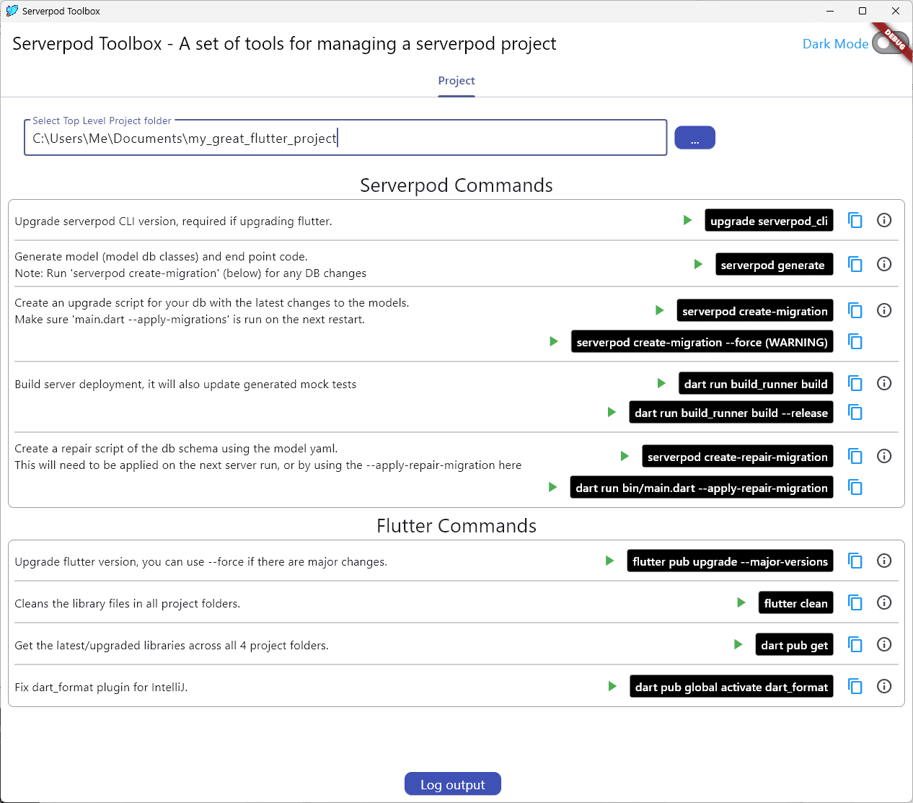

# Serverpod Toolbox

The Serverpod Toolbox is designed to optimise your Serverpod development workflow by automating common tasks, ensuring safe upgrades, 
and providing easy access to essential commands.  Simplify the process of building, running, and maintaining your Serverpod projects.

## Key Features

- **Automating Tasks:** Execute frequently used commands with a single click
- **Command Library:** Access an organized list of commands.
- **Upgrade Assistance:** Provides a safe upgrade process and warnings of potential issues.
- **Risk Warnings:** Stay informed with alerts about potentially risky commands to keep your project safe.

## Installation and Setup

1. **Install the application:**  
   [serverpod_toolbox_installer.exe](https://github.com/KomosSolutions/serverpod_toolbox/blob/master/installer/Output/serverpod_toolbox_installer.exe)

2. **Set Project Folder:** Set the project to the top level serverpod folder.

**Supported Project Structure:**
Your project should contain the standard serverpod folder structure:  
/project_name_flutter/  
/project_name_server/  
/project_name_client/  
/project_name_shared/ (optional)  

Where 'project_name' is the name of your serverpod project

## Contributing

We welcome contributions to improve the toolbox! 

